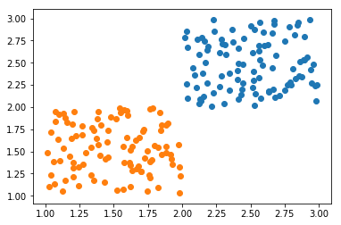

# 感知机算法是什么？
感知机算法只能处理二分类问题。它就是认为可以使用一个函数$f(x)=sign(wx+b)$来判断x属于哪个类。其中sign()是返回正负号的函数，w和b是需要根据所给定的样本数据进行学习得到。一般是用梯度下降来求解得到适合当前样本数据的w和b。
当模型的返回值与标签相符的时候有$(wx+b)*label>0$。当模型的返回值与标签不符的时候有$(wx+b)*label<=0$，此时模型输出错误需要利用梯度下降根据数据对w和b进行调整。如果还不了解梯度下降可以看看这两篇文章：[高中生能看懂的梯度下降是个啥？](https://zhuanlan.zhihu.com/p/43452377)，[通俗的随机梯度下降理论与实践](https://zhuanlan.zhihu.com/p/59678480)。

感知机的在分类错误时的损失函数为$L(w,b)=-(wx+b)*label$
由于梯度下降中需要求损失函数对各个参数的导数，所以我们就损失函数对各个参数进行求导。
求导的结果为：

$\frac{dL(w,b)}{dw}=-x*label\\\frac{dL(w,b)}{db}=-label$。

所以在感知机算法中梯度下降调整w与b的方法是（$\alpha$是学习率）：

$w = w + \alpha *\frac{dL(w,b)}{dw} = w + \alpha *x*label\\
b = b + \alpha *\frac{dL(w,b)}{db}=b + \alpha *label$


用伪代码表示就是：
```python
随机初始化w和b。
设置学习率alpha = 0.001
while(还有样本数据):
    1. 输入一条样本数据x，其标签为label,其中label的取值范围是{+1或-1}。
    2. 计算result = (w*x+b)*label，判断这个值是否小于0.
    3. if(result<0): #那就证明分类错误需要用梯度下降调整w和b
    4.     w = w + alpha*x*label
    5.     b = b + alpha*label
    
# 最终得到不错的w和b，此时sign(wx+b)就是我们训练好的模型。
```
# 下面是Python代码实践


```python
import numpy as np

# 加载测试数据，我自己构造两种类的数据
def generateData():
    # 类别0与类别1的中心
    center0 = np.array([2,2])
    center1 = np.array([1,1])
    data_size = 200
    
    data = np.zeros((data_size,3))
    
    # 类别0与类别1的数据
    data[:data_size//2, 0:2] = center0 + np.random.random((data_size//2,2))
    data[:data_size//2, -1] = -1
    data[data_size//2:, 0:2] = center1 + np.random.random((data_size - data_size//2,2))
    data[data_size//2:, -1] = 1
    np.random.shuffle(data)
    return data

data = generateData()
# 绘制数据分布
import matplotlib.pyplot as plt
plt.scatter(data[data[:,-1]==-1,0],data[data[:,-1]==-1,1])
plt.scatter(data[data[:,-1]==1,0],data[data[:,-1]==1,1])
plt.show()
data
```





    array([[ 1.63644631,  1.56041683,  1.        ],
           [ 2.53397922,  2.15200485, -1.        ],
           [ 1.61910265,  1.34878378,  1.        ],
           [ 1.38395069,  1.57205827,  1.        ],
           [ 2.40370965,  2.41096131, -1.        ],
           [ 1.2074177 ,  1.95057422,  1.        ],
           [ 1.84393566,  1.73642156,  1.        ],
           [ 1.52164348,  1.0624394 ,  1.        ],
           [ 2.66835539,  2.20507588, -1.        ],
           [ 1.4023369 ,  1.45445216,  1.        ],
           [ 2.15270493,  2.37936778, -1.        ],
           [ 1.33604892,  1.23208982,  1.        ],
           [ 2.11064204,  2.76420307, -1.        ],
           [ 1.92231898,  1.41869807,  1.        ],
           [ 2.5727606 ,  2.09838412, -1.        ],
           [ 1.45736401,  1.43556259,  1.        ],
           [ 2.36354776,  2.87613052, -1.        ],
           [ 2.56458356,  2.95968325, -1.        ],
           [ 2.83874992,  2.92253851, -1.        ],
           [ 1.76722165,  1.97739254,  1.        ],
           [ 1.06514369,  1.13781358,  1.        ],
           [ 2.850498  ,  2.95714484, -1.        ],
           [ 1.84788001,  1.80252496,  1.        ],
           [ 1.19459966,  1.80754509,  1.        ],
           [ 2.56331727,  2.32932948, -1.        ],
           [ 1.59298175,  1.65731846,  1.        ],
           [ 1.19001886,  1.64328013,  1.        ],
           [ 1.04110904,  1.23261488,  1.        ],
           [ 1.82531523,  1.54499332,  1.        ],
           [ 2.31728642,  2.59670187, -1.        ],
           [ 2.23455475,  2.85438533, -1.        ],
           [ 1.09850072,  1.91961828,  1.        ],
           [ 2.52208145,  2.30141387, -1.        ],
           [ 2.74786314,  2.74338563, -1.        ],
           [ 2.76906302,  2.25157159, -1.        ],
           [ 2.8255388 ,  2.32483029, -1.        ],
           [ 1.47608259,  1.89084659,  1.        ],
           [ 2.31165354,  2.70668271, -1.        ],
           [ 1.15896969,  1.83134211,  1.        ],
           [ 1.89749499,  1.81393787,  1.        ],
           [ 2.60136305,  2.69682848, -1.        ],
           [ 2.67639372,  2.10767439, -1.        ],
           [ 1.20092046,  1.21667837,  1.        ],
           [ 1.38186694,  1.86902264,  1.        ],
           [ 2.94541319,  2.26818176, -1.        ],
           [ 2.91249985,  2.56631111, -1.        ],
           [ 2.34603335,  2.19540036, -1.        ],
           [ 1.6235035 ,  1.106194  ,  1.        ],
           [ 1.45645049,  1.73962663,  1.        ],
           [ 1.26644966,  1.6892681 ,  1.        ],
           [ 1.87951863,  1.80141837,  1.        ],
           [ 1.40320532,  1.79681187,  1.        ],
           [ 1.74820602,  1.05327162,  1.        ],
           [ 2.67530255,  2.93488425, -1.        ],
           [ 2.78722536,  2.28418096, -1.        ],
           [ 1.63633729,  1.28613093,  1.        ],
           [ 2.30936026,  2.04400182, -1.        ],
           [ 2.65983366,  2.83465316, -1.        ],
           [ 2.03271   ,  2.26632745, -1.        ],
           [ 1.35324289,  1.17367967,  1.        ],
           [ 2.41388514,  2.08788269, -1.        ],
           [ 1.26624087,  1.79239043,  1.        ],
           [ 2.16056407,  2.74369189, -1.        ],
           [ 2.58527375,  2.46829034, -1.        ],
           [ 2.28943463,  2.35314973, -1.        ],
           [ 1.57708944,  1.37137381,  1.        ],
           [ 1.24351304,  1.32318936,  1.        ],
           [ 2.212467  ,  2.01344855, -1.        ],
           [ 1.55260488,  1.93736164,  1.        ],
           [ 2.59641672,  2.84841481, -1.        ],
           [ 1.3536629 ,  1.73425402,  1.        ],
           [ 2.12221146,  2.03612888, -1.        ],
           [ 2.75372684,  2.19229292, -1.        ],
           [ 1.76270741,  1.38458183,  1.        ],
           [ 1.24088879,  1.11400672,  1.        ],
           [ 1.68889294,  1.65379189,  1.        ],
           [ 1.33979663,  1.76574465,  1.        ],
           [ 2.80671213,  2.43509796, -1.        ],
           [ 1.66927284,  1.30916646,  1.        ],
           [ 2.44289274,  2.48746891, -1.        ],
           [ 1.71617642,  1.7327864 ,  1.        ],
           [ 1.09102978,  1.64172907,  1.        ],
           [ 1.84801129,  1.46473318,  1.        ],
           [ 1.42937094,  1.15525505,  1.        ],
           [ 1.61831971,  1.37664388,  1.        ],
           [ 1.5970926 ,  1.95537455,  1.        ],
           [ 2.983983  ,  2.2496169 , -1.        ],
           [ 1.69963821,  1.27676154,  1.        ],
           [ 2.27468869,  2.61348801, -1.        ],
           [ 2.45265933,  2.77772223, -1.        ],
           [ 2.41130839,  2.66882732, -1.        ],
           [ 1.14381214,  1.16934221,  1.        ],
           [ 1.75805572,  1.2299266 ,  1.        ],
           [ 2.12088849,  2.59596125, -1.        ],
           [ 1.33706068,  1.54961949,  1.        ],
           [ 1.78424514,  1.9905085 ,  1.        ],
           [ 2.13755308,  2.06511373, -1.        ],
           [ 2.03956713,  2.1010349 , -1.        ],
           [ 1.76523109,  1.20205154,  1.        ],
           [ 1.20681462,  1.31251085,  1.        ],
           [ 2.66990209,  2.97963887, -1.        ],
           [ 1.10580864,  1.39713343,  1.        ],
           [ 2.82101224,  2.81473832, -1.        ],
           [ 1.37235422,  1.6446835 ,  1.        ],
           [ 2.17070685,  2.49794428, -1.        ],
           [ 2.37453062,  2.73059734, -1.        ],
           [ 1.20500891,  1.37677089,  1.        ],
           [ 2.22962961,  2.16121591, -1.        ],
           [ 1.65978659,  1.62669369,  1.        ],
           [ 2.52970916,  2.01715137, -1.        ],
           [ 2.03805525,  2.67310501, -1.        ],
           [ 2.87767956,  2.34517857, -1.        ],
           [ 2.51834468,  2.61531939, -1.        ],
           [ 2.14330347,  2.78801772, -1.        ],
           [ 1.69705358,  1.27969349,  1.        ],
           [ 2.56901542,  2.53153782, -1.        ],
           [ 1.83914006,  1.93545032,  1.        ],
           [ 1.98062906,  1.32315954,  1.        ],
           [ 2.97444691,  2.24295727, -1.        ],
           [ 2.94101752,  2.4238809 , -1.        ],
           [ 1.97618227,  1.5811262 ,  1.        ],
           [ 2.10413702,  2.21733801, -1.        ],
           [ 2.22693803,  2.99002931, -1.        ],
           [ 2.09002723,  2.36434006, -1.        ],
           [ 2.62401485,  2.70557416, -1.        ],
           [ 2.50370631,  2.91618775, -1.        ],
           [ 1.82623638,  1.09635566,  1.        ],
           [ 1.97777213,  1.02915877,  1.        ],
           [ 2.52734616,  2.87459542, -1.        ],
           [ 1.57172968,  1.55383458,  1.        ],
           [ 2.15829786,  2.12364738, -1.        ],
           [ 1.07592242,  1.94792576,  1.        ],
           [ 2.43950373,  2.20046959, -1.        ],
           [ 2.62997421,  2.18119409, -1.        ],
           [ 2.89086255,  2.53514352, -1.        ],
           [ 1.92550075,  1.35834648,  1.        ],
           [ 2.55825466,  2.69320199, -1.        ],
           [ 1.13089354,  1.92822123,  1.        ],
           [ 2.85962293,  2.51760062, -1.        ],
           [ 2.97695262,  2.07226023, -1.        ],
           [ 1.6194913 ,  1.51272375,  1.        ],
           [ 1.04295563,  1.71817968,  1.        ],
           [ 2.78616749,  2.90225262, -1.        ],
           [ 2.71063115,  2.12923281, -1.        ],
           [ 2.34272537,  2.38399535, -1.        ],
           [ 1.88352558,  1.48121604,  1.        ],
           [ 2.19133338,  2.68822401, -1.        ],
           [ 2.56229974,  2.63774824, -1.        ],
           [ 1.88472742,  1.56073424,  1.        ],
           [ 2.52258015,  2.39733169, -1.        ],
           [ 2.08013412,  2.44516248, -1.        ],
           [ 1.07329857,  1.84029398,  1.        ],
           [ 2.42801189,  2.1403852 , -1.        ],
           [ 2.89688525,  2.79530829, -1.        ],
           [ 2.1810153 ,  2.64397505, -1.        ],
           [ 1.79755544,  1.56177768,  1.        ],
           [ 2.2727097 ,  2.23470415, -1.        ],
           [ 2.51829918,  2.22391615, -1.        ],
           [ 1.01666516,  1.48500496,  1.        ],
           [ 2.66061332,  2.43851976, -1.        ],
           [ 1.27834455,  1.35073026,  1.        ],
           [ 1.7470455 ,  1.50729421,  1.        ],
           [ 1.60217061,  1.91328995,  1.        ],
           [ 1.12859716,  1.05768545,  1.        ],
           [ 1.45069977,  1.6071625 ,  1.        ],
           [ 1.43821061,  1.41144457,  1.        ],
           [ 1.91323832,  1.46113745,  1.        ],
           [ 1.51763852,  1.87104657,  1.        ],
           [ 2.93263519,  2.98282178, -1.        ],
           [ 1.14259237,  1.87773181,  1.        ],
           [ 2.85433875,  2.34816079, -1.        ],
           [ 2.03439362,  2.85572696, -1.        ],
           [ 1.02479135,  1.10396121,  1.        ],
           [ 2.686815  ,  2.58351338, -1.        ],
           [ 1.72883023,  1.42626702,  1.        ],
           [ 2.41156884,  2.49180962, -1.        ],
           [ 2.63319838,  2.17205197, -1.        ],
           [ 1.22469163,  1.68089102,  1.        ],
           [ 2.18500209,  2.27119277, -1.        ],
           [ 1.77679785,  1.40466998,  1.        ],
           [ 1.71832933,  1.75293743,  1.        ],
           [ 2.13227276,  2.09275759, -1.        ],
           [ 1.13459548,  1.5335348 ,  1.        ],
           [ 1.56713511,  1.07596083,  1.        ],
           [ 2.29433775,  2.71099765, -1.        ],
           [ 2.7971937 ,  2.24965601, -1.        ],
           [ 2.44281477,  2.27265101, -1.        ],
           [ 2.28696156,  2.76694837, -1.        ],
           [ 2.40432425,  2.31258168, -1.        ],
           [ 1.38370376,  1.95375642,  1.        ],
           [ 1.54158176,  1.99140266,  1.        ],
           [ 1.05919984,  1.38471153,  1.        ],
           [ 2.01972679,  2.78535058, -1.        ],
           [ 1.67812484,  1.33442277,  1.        ],
           [ 2.89074172,  2.52833526, -1.        ],
           [ 1.29450532,  1.48178854,  1.        ],
           [ 1.57652306,  1.96481532,  1.        ],
           [ 1.17638883,  1.44407422,  1.        ],
           [ 1.98733485,  1.21999342,  1.        ],
           [ 2.95605077,  2.48521268, -1.        ]])


```python

w = np.random.random((2,))
b = np.random.random()
alpha = 0.01
for _ in range(10):# 重复训练10次,如果只训练1次由于是随机初始化w与b所以一般准确率在70%~100%之间波动
    for item in data:
        x = item[0:-1]
        label = item[-1]
        predict_result = label*(np.dot(x,w)+b);

        # 预测错误则用梯度下降更新w与b
        if predict_result<=0:
            w = w + alpha*x*label
            b = b + alpha*label

predict =np.sign( np.matmul(data[:,0:2],w) + b);
print("准确率：",np.sum(predict==data[:,-1])/data.shape[0]*100.0,"%")

```

    准确率： 100.0 %
    
